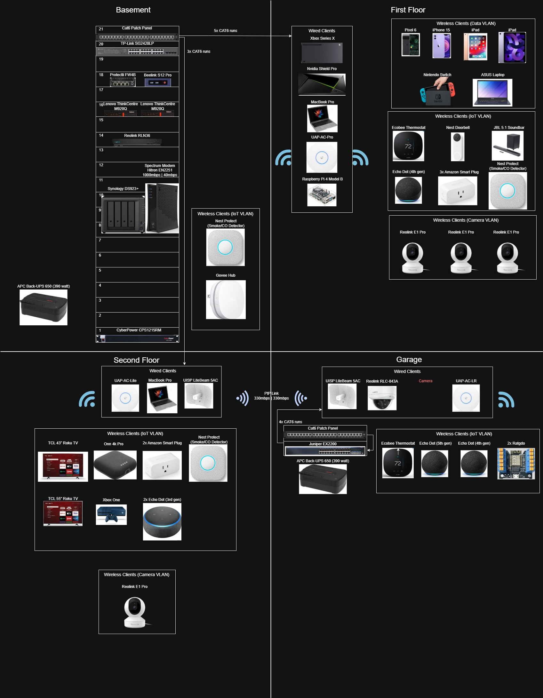

# 🏠 Home Network & Homelab Build

> A network engineer's ongoing journey building a home network from scratch — wiring, wireless, firewalls, virtualization, NAS, media server, home automation, and beyond.

---

## 🖥️ Current Hardware

### Network Infrastructure
| Device | Role |
|---|---|
| Protectli FW4B | Firewall (OPNsense) |
| TP-Link SG2428LP | Main switch, basement |
| Juniper EX2200 | Garage switch |
| Ubiquiti UAP-AC-Pro | Living room AP |
| Ubiquiti AC-LR | Garage AP |
| Ubiquiti AC-Lite | 2nd floor AP |
| Ubiquiti UISP LiteBeam 5AC ×2 | Point-to-point link, house ↔ garage |
| 21u Tripp Lite rack | Basement rack |

### Compute & Storage
| Device | Role |
|---|---|
| Lenovo M920Q (original) | Proxmox node 1 — primary services |
| Lenovo M920Q (new) | Proxmox node 2 — *arr stack |
| Raspberry Pi 4B | Secondary Pi-Hole + Proxmox Qdevice + RetroPie |
| Synology DS923+ | NAS — 3× 24TB SHR + 1× 12TB basic pool |
| Beelink Mini S12 Pro (N100) | Ubuntu DMZ node - Plex/Minecraft |

### Media & Cameras
| Device | Role |
|---|---|
| LG C4 OLED 65" | Primary display |
| Nvidia Shield Pro | Primary media client |
| Reolink 843A | Garage exterior camera (PoE, Synology SS) |
| Reolink E1 Pro ×4 | Interior cameras (Wi-Fi) |
| Reolink RLN36 NVR | Camera recording (16TB) |
| GL.iNet Comet PoE KVM | KVM over IP |

---

## 🧰 Services Running

| Service | Platform | Purpose |
|---|---|---|
| OPNsense | Protectli FW4B (bare metal) | Firewall, VLANs, NAT |
| Proxmox cluster | 2× Lenovo M920Q | Hypervisor |
| Beelink Mini S12 Pro | Bare metal (Ubuntu) | Dedicated Plex host |
| Home Assistant OS | Proxmox VM | Home automation |
| Pi-Hole (primary) | Proxmox LXC | Network-wide ad blocking |
| Pi-Hole (secondary) | Proxmox LXC | Network-wide ad blocking |
| Pi-Hole (tertiary) | Raspberry Pi 4B | DNS redundancy |
| Unifi Network App | Proxmox LXC | Wireless management |
| Omada Controller | Proxmox LXC | Switch management |
| Paperless-ngx | Proxmox LXC | Document management |
| Jellyfin | Proxmox LXC (Docker) | Media server |
| Jellystat | Proxmox LXC (Docker) | Jellyfin analytics |
| Tautulli | Proxmox LXC (Docker) | Plex analytics |
| Agregarr / Bazarr / Prowlarr / Radarr / Sonarr | Proxmox LXC (Docker) | Media management |
| Sabnzbd | Proxmox LXC (Docker) | Usenet downloader |
| Tailscale | Proxmox LXC (Debian) | Site-to-site VPN |
| Uptime Kuma | Proxmox LXC (Docker) | Service monitoring |
| Plex | Beelink (Docker) | Media server |
| Overseerr (Seerr) | Beelink (Docker) | Media requests |
| SWAG | Beelink (Docker) | Reverse proxy, DDNS, SSL |
| Minecraft | Beelink (Docker) | Game server |
| RetroPie | Raspberry Pi 4B | Retro gaming |

---

## 📋 Build Phases

| Phase | Date | Summary |
|---|---|---|
| [Setup](phases/phase-1.md#setup) | Late 2021 | Moved in, Juniper SRX210 + AC-Lite on the living room floor |
| [Phase 1a](phases/phase-1.md#phase-1a) | Feb 2022 | Ordered cabling and tools, started running ethernet, hit a wall with the old attic |
| [Phase 1b](phases/phase-1.md#phase-1b) | Dec 2022 | Finished all cable drops, garage 4u rack, card table "rack" in the basement |
| [Phase 2a](phases/phase-2.md#phase-2a) | Dec 2022 | Ubiquiti LiteBeam PtP link to garage, AC-LR AP — wifi in the garage! |
| [Phase 2b](phases/phase-2.md#phase-2b) | Dec 2022 | Hunt for a quiet PoE switch — ended up on TP-Link SG1016PE |
| [Phase 3](phases/phase-3.md) | Jan 2023 | 9u rack mounted to basement floor joists |
| [Phase 4](phases/phase-4.md) | Jan 2023 | Replaced Juniper SRX210 with Protectli FW4B running OPNsense |
| [Phase 5a](phases/phase-5.md#phase-5a) | Dec 2023 | Raspberry Pi 4B, DietPi, Pi-Hole |
| [Phase 5b](phases/phase-5.md#phase-5b) | Dec 2023 | Home Assistant in Docker — smart device rabbit hole begins |
| [Phase 6a](phases/phase-6.md#phase-6a) | Dec 2023 | Lenovo M920Q, Proxmox, LXCs for everything via Tteck scripts |
| [Phase 6b](phases/phase-6.md#phase-6b) | Dec 2023 | Synology DS923+, 4K disc ripping, Jellyfin, Nvidia Shield Pro |
| [Phase 7a](phases/phase-7.md#phase-7a) | Jan 2024 | Reolink garage camera, ratgdo garage door controllers, Home Assistant automations |
| [Phase 7b](phases/phase-7.md#phase-7b) | Feb 2024 | RetroPie on the Raspberry Pi |
| [Side Quest 1](phases/sidequests.md#side-quest-1) | Feb 2024 | NAS upgrade to 12TB drives, dedicated camera storage pool |
| [Phase 8a](phases/phase-8.md#phase-8a) | Feb 2025 | LG C4 OLED 65", migrated from Jellyfin to Plex, Spectrum 1Gbps |
| [Phase 8b](phases/phase-8.md#phase-8b) | Feb 2025 | Beelink Mini S12 Pro dedicated Plex server, SWAG reverse proxy |
| [Phase 9](phases/phase-9.md) | Mar 2025 | *arr stack — Radarr, Sonarr, Bazarr, Prowlarr, Sabnzbd, Overseerr |
| [Side Quest 2](phases/sidequests.md#side-quest-2) | Mar 2025 | NAS upgrade to 24TB drives, *arr media routed to single-drive pool |
| [Phase 10](phases/phase-10.md) | Apr 2025 | 4× Reolink E1 Pro interior cameras, Reolink RLN36 NVR, added UAP-AC-Pro |
| [Phase 11](phases/phase-11.md) | Jan 2026 | 2nd Lenovo M920Q, Proxmox 9.x cluster, RPi Qdevice |
| [Phase 12](phases/phase-12.md) | Feb 2026 | TP-Link SG2428LP switch, 21u rack, GL.iNet KVM |
| [Side Quest 3](phases/sidequests.md#side-quest-3) | Feb 2026 | Final NAS upgrade — all 3 SHR drives now 24TB, 12TB freed for NVR |
| [Phase 13](phases/phase-13.md) | To come | Exterior cameras, local smart home (replace Alexa), PoE doorbell, freezer temp probe |

---

## 🗺️ Network Overview

**VLANs in use:**
- Main LAN
- IoT
- Camera
- DMZ

**ISP:** Spectrum 1000/40 Mbps

---

## 💰 Rough Cost Breakdown

| Category | Approx. Cost |
|---|---|
| Network infrastructure (phases 1–4) | ~$1,500 |
| Raspberry Pi 4B + accessories | ~$100 |
| Lenovo M920Q ×2 | ~$400 |
| Synology DS923+ + drives | ~$2,300 |
| Beelink Mini S12 Pro | ~$170 |
| Nvidia Shield Pro | ~$200 |
| LG C4 OLED 65" | ~$1,500 |
| Cameras + NVR | ~$400 |
| 21u rack + SG2428LP switch | ~$400 |
| Misc (RPi, ratgdo, KVM, etc.) | ~$300 |
| **Total (approx.)** | **~$7,300+** |

---

## 🔭 What's Next (Phase 13)

- [ ] Exterior camera for the garage + additional house cameras
- [ ] Replace Amazon Echos and smart plugs with a local solution
- [ ] Properly mount the 2nd floor AP (currently sitting loose in the attic)
- [ ] Upgrade Google Nest doorbell to a Reolink PoE doorbell
- [ ] PoE temperature probe for the chest freezer

---

*This is a living document — updated as the project evolves. Questions welcome.*
